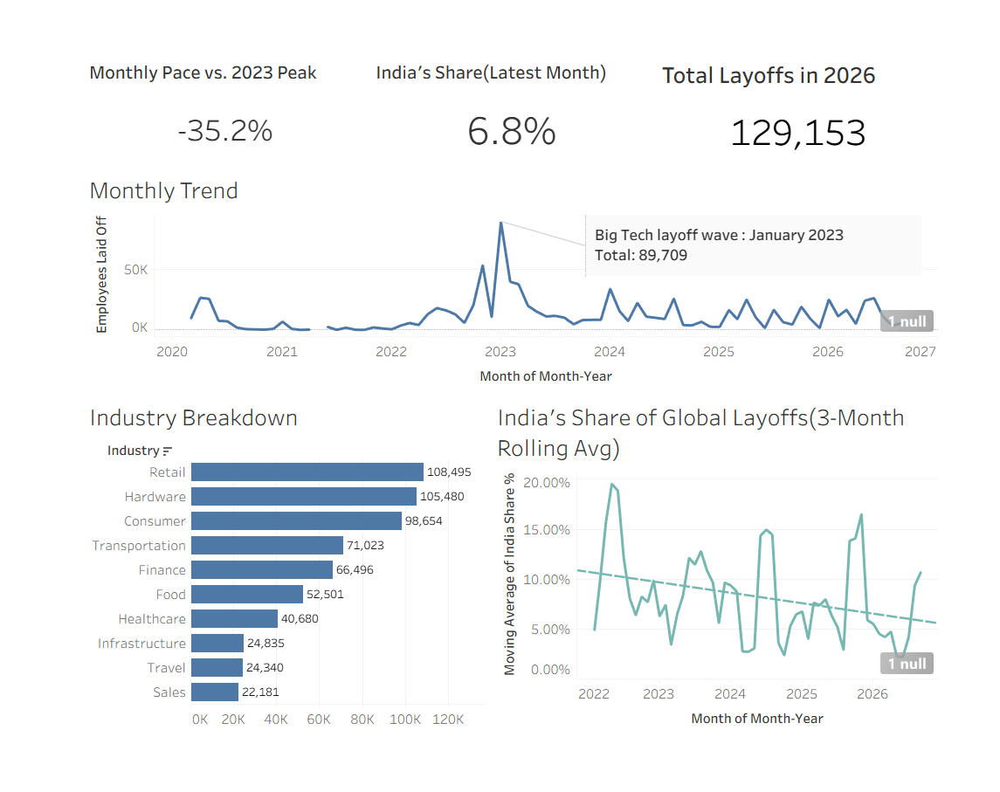

# Tech Layoffs & Hiring Trends Dashboard (2020–2026)

An interactive Tableau dashboard analyzing 4,600+ global tech layoff events from March 2020 to September 2026, built to surface industry patterns, long-term trend direction, and India-specific impact within the global data.

**🔗 Live Dashboard:** (https://public.tableau.com/app/profile/aesha.bhatt/viz/LayoffsTrend/Dashboard1)

---

## Key Findings

- **January 2023 was the single worst month** in the dataset, with 89,709 layoffs recorded in one month — consistent with the well-documented wave of mass layoffs at Google, Microsoft, Amazon, and Meta.
- **2026's monthly layoff pace is running 35.2% below the 2023 peak**, based on a fair, apples-to-apples comparison of monthly averages (not raw totals, since 2026 data is partial-year).
- **India accounted for 6.8% of global tech layoffs** in the most recent complete month, with a long-term declining trend (from ~11% in 2022 to ~6% by 2026) despite sharp, event-driven spikes.
- **Retail (108,495), Hardware (105,480), and Consumer (98,654)** were the three hardest-hit named industries overall.

## Dataset

Sourced from a public, continuously-updated dataset mirroring [layoffs.fyi](https://layoffs.fyi), via [Kaggle: Layoffs Dataset](https://www.kaggle.com/datasets/swaptr/layoffs-2022). Fields: company, location, total laid off, date, percentage laid off, industry, source, funding stage, funds raised, country.

## Data Cleaning & Key Decisions

Raw data required real cleaning before analysis — documenting the decisions here since they matter as much as the charts:

- **Fixed date field**: originally stored as text, which silently broke any chronological sort or aggregation. Converted to a true date type.
- **Standardized 15 duplicate company names** caused by inconsistent casing and stray whitespace (e.g. `Tiktok` vs `TikTok`, `Wayfair ` vs `Wayfair`) using Tableau Groups, so company-level counts aren't artificially inflated.
- **746 rows (16% of the dataset) had a confirmed layoff event but no headcount number.** Rather than dropping them (losing real data) or filling with 0 (falsely implying no impact), these were flagged as "Unspecified" and kept visible but excluded from headcount-sum calculations — a more transparent approach.
- **Excluded "Other" from the industry breakdown chart.** As a catch-all bucket, it was misleadingly the largest bar and added no analytical value; removing it made the "which industries got hit hardest" story actually answerable.
- **Compared monthly averages, not raw totals, for the peak comparison.** 2026 is a partial year; comparing its raw total directly to a full year (2023) would have been a misleading comparison.
- **Applied a 3-month rolling average to India's share trend**, after discovering the raw monthly % was highly volatile in early months due to small sample sizes (a handful of global events some months meant one India event could swing the ratio to 50-100%).

## Dashboard Structure

- **KPI row**: Total 2026 layoffs, monthly pace vs. 2023 peak, India's latest-month share
- **Monthly Trend**: Full timeline, March 2020 – September 2026, annotated at the January 2023 peak
- **Industry Breakdown**: Top 10 industries by total laid off, labeled bars
- **India's Share of Global Layoffs**: 3-month rolling average with linear trend line, filtered to 2022+ for reliability

## Tools

Tableau (data cleaning via Groups & calculated fields, table calculations, dual-axis charts, dashboard containers)

---
